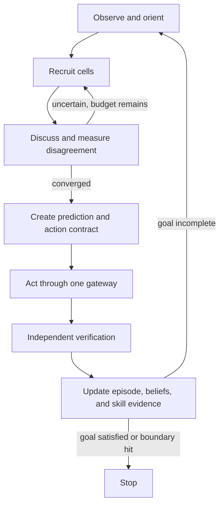

# Leviathan as One Agent: Recursive Build Plan

## Purpose

Leviathan should become one persistent learning system, not a committee of chatbots.

The repository already contains most of the architectural organs: adaptive compute,
belief state, memory, world modeling, tools, verification, causal credit, learning, and
governance.  The missing engineering center is a runtime that makes those organs serve
one identity, one externally anchored goal, one evolving state, and one auditable
trajectory.

This document turns that center into a recursive research plan.  It separates what can
be implemented as software now from what needs neural training, substantial compute, or
new science.

## North star

Given an unfamiliar environment, one Leviathan agent should:

1. orient before committing;
2. preserve several plausible hypotheses;
3. choose cognition or action for goal-relevant information gain;
4. predict before acting;
5. test predictions against independent evidence;
6. localize what caused success or failure;
7. turn repeated verified discoveries into reusable skills;
8. learn locally without corrupting inherited competence or its governing objective.

The target trajectory is:

`unknown world -> orient -> hypothesize -> discriminate -> act -> verify -> explain error -> learn -> transfer`

The agent is complete only when this improves across unrelated environments from a
small number of useful experiences.  A sophisticated orchestration demo is not enough.

## What "one agent" means

One agent does **not** mean one giant function and it does not mean every internal
component shares authority.

It means:

- one stable `agent_id`;
- one immutable original-goal record;
- one serialized belief and memory state;
- one metacognitive budget allocator;
- one append-only causal trajectory;
- one action gateway;
- one learning proposal pipeline;
- one externally held constitution and promotion authority.

Internal models, tools, search branches, hypotheses, and Cognitive Parameter Cells are
organs.  They can disagree and specialize, but none is a separately goaled actor.

The authority boundary is strict:

| Component | May propose | May execute | May verify itself | May write durable learning | May alter constitution |
|---|---:|---:|---:|---:|---:|
| Parameter cell | yes | no | no | no | no |
| Cell ecology | yes | no | no | no | no |
| Leviathan agent | chooses | through gateway | no | only through gates | no |
| External executor | no | contracted action only | no | no | no |
| Independent verifier | no | measurement only | yes, for its scope | no | no |
| Governor/release process | no | promotion only | audits evidence | yes | externally only |

This is how `learner != governor`, `generator != verifier`, and `agent != auditor` remain
true while the product still behaves as one agent.

## The recursive unit

Every scale uses the same research recursion:

1. **Frame** one falsifiable capability claim.
2. **Freeze** the current baseline, goal, tests, and cost measurements.
3. **Insert** the smallest reversible mechanism with zero or identity effect where
   pretrained function is involved.
4. **Run** it inside hard compute, risk, and time limits.
5. **Falsify** it with counterexamples, ablations, independent tests, and old-skill
   regression.
6. **Promote** only if verified capability per lifetime compute improves.
7. **Compile** the successful procedure into the next baseline, then recurse on the
   next bottleneck.

If a prerequisite or verifier is missing, the recursion stops at that boundary.  It
routes around a replaceable implementation problem; it does not force its way through
an unknown scientific or governance problem.

## The agent's inner cycle

The two recursion controls are different:

- **inner recursion** spends more cells or communication rounds when disagreement is
  high;
- **outer recursion** takes another observe-act-learn cycle only when the goal remains
  incomplete and the expected marginal value is positive.

Both have hard ceilings.  Non-convergence is a result to report, not permission to take
the current plurality and act anyway.

## L1.5: the Parameter Ecology

The proposed bottom-level primitive is a Cognitive Parameter Cell:

`C_i = (theta_i, state_i, recruitment_keys_i, quality_i, message_interface_i)`

For one state transition:

1. a small seed set is recruited associatively;
2. each cell emits a candidate, confidence, evidence references, and optional peer
   requests;
3. votes are aggregated without exposing every cell's private state;
4. disagreement controls whether more cells and another round are worth their cost;
5. a bounded consensus commits one candidate;
6. repeated externally verified coalitions become direct routing priors;
7. new learning remains local to the responsible cells or coalition.

This is deeper than ordinary MoE routing.  MoE chooses a few large feed-forward experts.
The Parameter Ecology assembles a temporary function from many smaller stateful units,
allows limited communication, and can compile recurring cooperation.

The Python implementation in `src/leviathan/cells.py` is a **behavioral reference
runtime**.  It tests recruitment, consensus, escalation, budgets, failure isolation, and
coalition compilation.  It is not evidence that a neural MoP layer already works.

## What this branch implements

The first executable vertical slice spans the safest parts of Stages 0 through 3:

- `LeviathanAgent` as the single owner of identity, goal, journal, action contracts,
  episodes, and durable coalition evidence;
- a frozen `GoalFrame` and `AgentPolicy`, each protected by a digest checked around the
  cycle;
- an immutable metacognitive snapshot so a cell cannot rewrite the active goal;
- sparse cell recruitment and one-to-five bounded discussion rounds;
- confidence-weighted consensus and entropy-based disagreement;
- disagreement-driven peer recruitment;
- hard round, active-cell, and total-cell-call budgets;
- per-cell fault isolation, so one failed experimental organ does not collapse the
  agent;
- no action when discussion fails to converge;
- prediction-before-action `ActionContract` records;
- risk, authorization, reversibility, precondition, executor, and verifier gates;
- independent verification thresholds using the existing provenance trust model;
- negative-verifier vetoes;
- repeated externally verified coalition compilation, without parameter updates;
- append-only events and closed episode records for later causal analysis.

This is the constitutional skeleton.  It makes later neural and learning experiments
comparable instead of letting each prototype quietly change the rules.

## Recursive build ladder

Each rung must pass before the next receives authority.  Work inside a rung repeats the
seven-step research recursion above.

### R0. Constitutional single-agent kernel — implemented now

**Claim:** heterogeneous internal cognition can be coordinated under one identity and
one goal without giving proposal modules action or learning authority.

**Build:** the reference cell ecology, single agent, event journal, contracts, risk
gates, independent verifier gate, and procedural coalition cache.

**Measure:** determinism, bounded calls, action-gate coverage, event ordering, failure
containment, and whether unverified outcomes can change routing.

**Pass:** every effect is attributable to one goal-bound contract; no failed,
non-converged, or self-verified path is promoted.

### R1. Epistemic state kernel — next

**Claim:** an explicit belief ledger beats raw history on long, contradictory tasks.

**Build bit by bit:**

1. append-only observations with provenance;
2. beliefs with confidence, status, scope, and supporting/contradicting evidence;
3. parallel hypothesis sets;
4. prediction records written before outcomes;
5. typed causal edges;
6. loss-aware state compaction;
7. calibration buckets by domain, source, mode, and model version.

**Measure:** contradiction rate, repeated-context cost, belief survival under new
evidence, calibration error, and information lost during compaction.

**Stop condition:** if explicit state merely restates model prose or silently raises
trust during summarization, do not connect it to learning.

### R2. Novel-environment learner

**Claim:** the agent can infer a hidden environment rule in roughly 3–20 useful
experiences and reuse it in a held-out environment.

**Build bit by bit:**

1. orientation policy that maps controllable objects and possible feedback;
2. diverse hypothesis generator;
3. explicit differentiating predictions;
4. low-risk experiment selector using goal-conditioned information gain;
5. Bayesian or calibrated evidence update baseline;
6. rule/theory induction over programs, graphs, equations, or latent dynamics;
7. held-out transfer test before any skill promotion.

**Measure:** interactions to first success, interactions to calibrated rule recovery,
held-out transfer, regret, and unsafe/redundant actions.

**Stop condition:** success by memorizing environment identifiers, exhaustive search,
or hindsight explanation does not count.

### R3. Memory ecology and cognitive compilation

**Claim:** verified experience raises future success while reducing future compute.

**Build bit by bit:**

1. causal episode schema;
2. retrieval by failed belief, action pattern, and causal structure, not only text
   similarity;
3. semantic claims supported by several episodes;
4. versioned procedural skills with typed preconditions and attached verifiers;
5. failure-triggered demotion;
6. verified coalition-to-skill compilation;
7. scheduled merge, decay, compression, and contradiction review.

**Measure:** success and cost curves over repeated task families, false-memory rate,
skill misuse outside scope, and recovery after environment changes.

**Stop condition:** a skill that is cheaper but less reliable, weakly scoped, or hard to
invalidate is not an improvement.

### R4. World model and causal accountability

**Claim:** action-conditioned models improve real decisions and locate causal failure,
after charging for simulator error and compute.

**Build bit by bit:**

1. short-horizon state prediction baseline;
2. action-conditioned alternatives;
3. adaptive simulation resolution;
4. predicted-versus-observed calibration;
5. trajectory dependency graph;
6. retrospective counterfactuals;
7. credit updates limited by counterfactual confidence and provenance.

**Measure:** decision gain over no-simulator baseline, simulation/reality gap,
counterfactual accuracy where interventions exist, and whether learning changes the
true causal predecessor instead of the nearest action.

**Stop condition:** simulator confidence may never promote simulator-only claims into
grounded truth.

### R5. Neural Mixture-of-Parameters parity

**Claim:** a pretrained transformation can be decomposed into smaller parameter bases,
sparsified, and given bounded communication without losing inherited function.

**Build bit by bit:**

1. factor one frozen linear or FFN transformation into additive bases;
2. activate every required basis and prove output parity;
3. train a sparse router by distillation while the original path remains active;
4. add redundant zero-gated cells;
5. specialize cells by operation and semantic context;
6. add one communication round behind a zero gate;
7. make disagreement control active cells and rounds;
8. compare compiled coalitions with fresh routing;
9. repeat across layers only after the single-layer ablation passes.

**Measure:** perplexity/output drift, downstream retention, active parameters, bytes
moved, latency, calibration, disagreement quality, and cost per successful task.

**Stop condition:** if communication adds latency without improving verified work, keep
the sparse bases and remove discussion.  If sparse routing cannot reach dense parity,
the pretrained path stays authoritative.

### R6. Local plasticity and functional neurogenesis

**Claim:** verified new skills can be learned in small cells or newly allocated
descendants with less interference than global fine-tuning.

**Build bit by bit:**

1. task-local disposable state;
2. reversible cell adapters;
3. replay and interference probes;
4. local learning-policy baseline;
5. allocate a child cell when measured interference exceeds a threshold;
6. sandbox train, evaluate, shadow, and promote or delete;
7. merge/prune redundant descendants.

**Measure:** new-skill gain, protected-skill regression, calibration drift, bytes added,
active compute, and rollback success.

**Stop condition:** no online experience updates the ancestral/core path directly.

### R7. Representation and cognitive compilers

**Claim:** choosing a problem-specific representation and program beats fixed token
reasoning across diverse tasks.

**Build bit by bit:**

1. typed objects for entities, events, quantities, hypotheses, constraints, and goals;
2. reversible compression/expansion with explicit information-loss tests;
3. a small fixed operator algebra;
4. typed cognitive bytecode;
5. compiler from task state to bounded operator program;
6. runtime graph synthesis from that program;
7. temporary concept and internal-DSL invention;
8. compile verified programs into procedures.

**Measure:** accuracy, transfer, representation size, cognitive steps, invalid state
transitions, and reconstruction loss on task-relevant facts.

**Stop condition:** invented representations must be inspectable through typed
projections and cannot bypass goals, action gates, or provenance.

### R8. Persistent heterogeneous runtime

**Claim:** one agent can remain coherent while perception, memory, planning, tools, and
control run at different timescales and hardware locations.

**Build bit by bit:**

1. event-triggered module scheduling;
2. cognitive state residency metadata;
3. near-memory filtering;
4. joint precision/location/compute routing;
5. distributed append-only journal and recoverable snapshots;
6. deterministic replay after process failure;
7. cognitive IR lowered to CPU, GPU, storage, and remote execution backends.

**Measure:** recovered-state equivalence, stale-state errors, bytes moved, queueing,
tail latency, energy proxy, and task success per wall-clock cost.

**Stop condition:** hardware optimization cannot weaken verification, provenance, or
goal integrity.

### R9. Canonical Leviathan latent — research wall

**Claim:** different frozen pretrained models can map useful state into a typed shared
latent without destroying their competence, eventually making the substrate
replaceable.

The safe sequence is adapter reconstruction, cross-model semantic alignment, typed
latent slots, limited Leviathan-native computation, and only then possible migration.

R9 begins only after R0–R8 show that the higher cognitive architecture is worth
preserving.  Running substantial cognition in a new latent needs serious continued
training.  A portable foundation-independent cognitive IR is a research-lab-scale
program, not a repository wiring task.

## First neural experiment sequence

The first MoP study should stay small and answer one question at a time:

| Experiment | Change | Frozen baseline | Promotion gate |
|---|---|---|---|
| E0 | Python cell-market simulator | current controller | bounded convergence and trace correctness |
| E1 | Additive basis decomposition of one FFN | original FFN | numerical/output parity |
| E2 | Learned Top-K basis router | dense basis use | retention at lower active compute |
| E3 | Redundant zero-gated cells | sparse E2 | exact insertion parity |
| E4 | One aggregate communication round | E3 | verified task gain exceeds latency |
| E5 | Disagreement-based expansion | fixed active count | lower cost at matched success |
| E6 | Coalition cache | fresh routing | cheaper repeats without generalization loss |
| E7 | Local reversible adapter update | frozen E6 | new-skill gain with bounded regression |
| E8 | Cell birth/merge/prune | fixed reservoir | lifetime gain after storage/compute cost |

Do not combine E2 through E8 into one training run.  A positive result would be
uninterpretable and a negative result would reveal nothing about which assumption
failed.

## Evaluation spine

Every rung reports the same four ledgers:

### Capability

- success on held-out tasks;
- sample efficiency in novel environments;
- transfer across unrelated task families;
- recovery after misleading evidence.

### Epistemics

- calibration error;
- prediction-before-outcome accuracy;
- hypothesis diversity and collapse rate;
- verifier independence and coverage;
- provenance preservation.

### Lifetime learning

- compute to solve a repeated task over experience count;
- false semantic/procedural promotion rate;
- old-skill regression;
- rollback success;
- skill invalidation latency.

### Systems

- active/total parameters;
- cell calls and rounds;
- bytes moved and state footprint;
- wall-clock latency;
- cost per verified success.

No single aggregate score can waive a failed governance invariant.

## Kill criteria

The following results should simplify or stop a branch rather than trigger more scale:

- cell discussion performs no better than one aggregation pass after matched compute;
- disagreement is not calibrated with error or information value;
- compiled coalitions overfit routing keys and fail held-out transfer;
- explicit belief state raises confidence without new independent evidence;
- world-model planning wins only inside the simulator;
- local plasticity causes accumulating protected-skill or calibration regression;
- the controller learns to avoid difficult but important tasks;
- any component needs access to goal, verifier, rollback, and promotion authority at the
  same time;
- an improvement disappears when measured as cost per **verified** success.

## Immediate next implementation slices

After this branch, the narrowest valuable sequence is:

1. add a versioned belief ledger and observation-to-belief update contract;
2. add a causal episode DAG using the existing journal references;
3. build two tiny hidden-rule environments for novel-environment learning;
4. add a deterministic information-gain baseline and a random-action control;
5. compile a verified rule into a scoped procedure and test transfer/invalidation;
6. only then begin E1, the single-FFN neural basis-parity experiment.

That sequence gives the rocket a guidance system before adding a larger engine.
