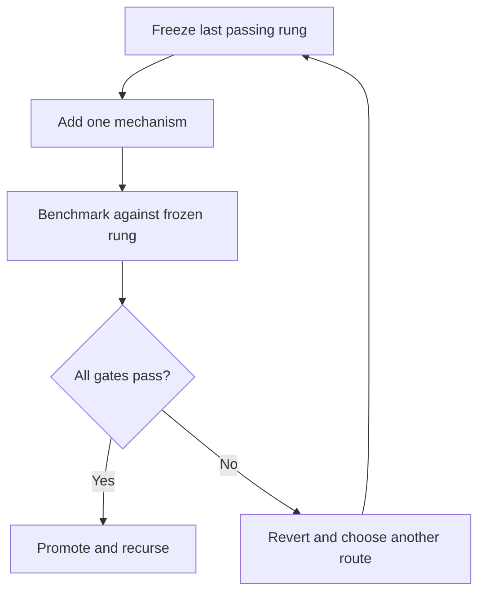

# One Leviathan: strict single-model plan

## Correction accepted

One agent does not mean a civilization of models wearing one name. Leviathan's
cognitive core is one trainable function with one parameter owner, one shared state,
one objective, one optimizer, one checkpoint and one output. The previous Parameter
Ecology abstraction violated the spirit of that requirement because its cells had
identities, private behavior, proposals, messages and votes. It has been removed from
the active architecture.

This document is the new line in the sand. A future implementation that crosses it is
not Leviathan's one-agent path, even if it exposes only one API.

## The one-model invariant

Let the entire cognitive model be

`(h_next, decision, uncertainty) = F_theta(observation, h, goal, budget)`.

There is one `theta`, one `h`, and one final decision distribution. Additional compute
may apply a shared block again to `h`; it may not start another independently stateful
model and call the result deliberation.

| Property | Required count | Meaning |
|---|---:|---|
| Cognitive parameter owner | 1 | every trainable tensor is in one state dictionary |
| Shared cognitive state | 1 | branches and hypotheses are data, never private minds |
| Learned router | 1 | routing is a layer of `F_theta` |
| Training objective | 1 | one scalar loss owns credit assignment |
| Optimizer | 1 | one update step covers the whole parameter state |
| Checkpoint | 1 | one artifact restores the complete cognitive function |
| Decision output | 1 | no proposal aggregation or majority vote |
| Independent internal models | 0 | no separately prompted, trained or stateful specialists |

Ordinary layers, attention heads, memory slots and parameter tensors are allowed. They
are parts of a model. A component is disallowed when it can be separately prompted,
independently optimized, independently checkpointed, keep private task state, or emit a
candidate that must be negotiated with other candidates.

The boundary is executable as well as documentary: every `CognitiveKernel` supplies a
`KernelManifest`, and `LeviathanAgent` rejects any count that differs from the table,
including any nonzero `independent_internal_models` value. A manifest cannot prove that
arbitrary third-party code is honest, so source review and checkpoint inspection remain
promotion requirements.

## Boundaries are not extra minds

The agent envelope, executor and verifier remain separate in authority, not in
cognition:

- `LeviathanAgent` preserves identity, goal integrity, journal order and action gates.
- the one `CognitiveKernel` produces the decision;
- an executor applies an authorized contract to the environment;
- a verifier measures what happened.

The executor is an effect boundary and the verifier is an instrument. Neither suggests
what the model should think or joins its inference. This keeps `generator != verifier`
without turning the generator into a committee.

## Current executable kernel

`src/leviathan/kernel.py` defines the singular runtime contract. One cycle invokes one
kernel and consumes one `InferenceTrace`. Failure, invalid output, no decision or budget
exhaustion stops before action.

`src/leviathan/mop.py` implements the smallest trainable Mixture-of-Parameters claim:

`y = x W_base + b + sum_e g_e(c) (x A_e) B_e`

The `e` axis is a tensor axis. It does not enumerate models. `A` and `B` slices cannot
be called, prompted, assigned goals, given memory, or optimized alone. The router,
bases and dense path are trained by one loss and saved in one checkpoint.

`B` starts at zero. Therefore adding the whole routed path changes the base output by
exactly zero while leaving a gradient path into `B`. This is the function-preserving
entry point required by the Omega transplantation plan.

## Benchmark before architecture

The benchmark uses three fixed seeds and equal training steps. The primary task is a
conditional low-rank operator—the exact hypothesis a Mixture-of-Parameters block is
supposed to fit. The comparison dense MLP has nearly the same total parameters. An
unseen two-context composition split tests limited transfer. A dense nonlinear teacher
is included as a negative control so the home-field result cannot be advertised as
general superiority.

Run it with:

```bash
PYTHONPATH=src python benchmarks/benchmark_single_model.py
```

Recorded results are in `benchmarks/results/single_model_v0.4.0.json`.

| Measurement, mean over seeds 7/17/29 | Dense MLP | MoP result |
|---|---:|---:|
| Total parameters | 591 | 582 |
| Top-2 active parameters | 591 | 258 |
| Estimated MACs/example | 566 | 256 |
| Conditional held-out MSE | 0.33439 | **0.00940** staged Top-2 |
| Unseen composition MSE | 1.03466 | **0.30133** staged Top-2 |
| Nonlinear negative-control MSE | **0.01003** | 0.11512 staged Top-2 |
| Batch-512 NumPy latency | **52.894 us** | 343.281 us Top-2 |

Two parity checks passed: zero-gated insertion had maximum absolute error `0.0`, and a
full SVD reconstruction had error `2.61e-15`.

### The asteroid found by the benchmark

Training all routes and pruning to Top-2 afterward failed: mean MSE rose from `0.02163`
with all bases to `0.83442` with Top-2. The route had not learned to survive scarcity.

The bounded alternative was one staged schedule, not an open-ended rescue campaign:

1. train the one model with all bases for the first third of steps;
2. continue the same optimizer and checkpoint with Top-2 routing;
3. compare against both the dense baseline and failed post-hoc pruning.

That route reached `0.00940` MSE and passed the algorithmic gates. It did **not** produce
a runtime speedup: the unfused NumPy Top-2 path was `6.49x` slower than the small dense
MLP despite using an estimated `45.2%` of its MACs. Therefore:

- promote staged sparse training as an operator hypothesis;
- reject post-hoc sparsification;
- reject any wall-clock efficiency claim from this implementation;
- do not treat the linear operator as a complete cognitive model;
- do not add recurrence yet.

The nonlinear negative control is equally important. It says the routed update belongs
inside a nonlinear sequence model; it cannot replace one.

## Recursive build rule

Every rung uses the same recursion:



“All gates” means capability, retention, epistemics and measured systems cost. A gain in
one ledger cannot erase a hard failure in another. Results, seeds, hardware and failed
ablations stay in the repository.

## R0 — singular cognitive boundary

**State:** implemented.

**Build:** replace the proposal market with `CognitiveKernel.infer(context) ->
InferenceTrace`; invoke it once per cycle; keep goal/action governance outside the
learned model.

**Pass:** one call, one decision, explicit failure state, no action after failure or
budget exhaustion, immutable goal and policy.

**Regression:** unit tests inspect call count, event order, risk gates and verifier
independence.

## R1 — function-preserving parameter substrate

**State:** passed on the numerical proof operator.

**Build bit by bit:** decompose one dense transform; insert low-rank bases with a zero
final factor; verify exact equality; verify explicit gradients by finite differences;
round-trip the complete function through one checkpoint.

**Pass:** insertion error at floating-point zero, finite-difference gradient agreement,
one optimizer lowers loss, checkpoint reload is bit-exact.

**Stop:** any unexplained base-function drift.

## R2 — learned conditional routing

**State:** passed only for dense routing on the conditional low-rank task.

**Build:** one router inside the model; all bases contribute to one weighted transform;
train with the same samples, steps and initial dense path as the baseline.

**Measure:** held-out loss, composition loss, route entropy, total parameters and MACs.

**Stop:** a win that disappears under matched parameters or a negative control.

## R3 — sparse parameter activation

**State:** algorithmic gate passed; wall-clock gate failed.

**Build:** dense warmup followed by Top-2 training in the same model. Sparse inference
gathers selected tensor slices before multiplication; inactive transforms are not
computed and masked afterward.

**Pass:** better held-out loss at no more than 60% of dense MACs. The current result
passes this limited gate.

**Blocked claim:** efficiency. A framework-level fused gather/matmul kernel must beat
the dense wall clock on realistic dimensions before the word “faster” is allowed.

## R4 — one nonlinear sequence block

**State:** next.

**Build bit by bit:**

1. freeze a small pretrained sequence block;
2. insert one zero-initialized routed low-rank residual into its feed-forward path;
3. train dense routing on a small sequence suite;
4. repeat the staged Top-K schedule;
5. compare against the untouched block, a dense adapter and a parameter-matched MLP;
6. measure retention on protected tasks and real wall time;
7. promote only the smallest passing form.

**Measures:** next-token loss, task accuracy, calibration, protected-task regression,
active/total parameters, peak memory and p50/p95 latency.

**Stop:** the routed block wins only on its matched synthetic teacher, loses protected
capability, or needs a second model to route it.

## R5 — shared-state adaptive refinement

**State:** gated behind R4 and a fused R3 runtime.

This is where recursion may enter, but only as repeated application of the same block:

`h_(r+1) = F_theta(h_r, observation, goal, budget)`.

The halting scalar is another output of the same model. There are no round-specific
models and no messages. Compare one, two and adaptive passes at matched compute.

**Pass:** adaptive passes improve verified success or calibration per wall-clock cost.

**Stop:** fixed one-pass or fixed-depth inference performs as well. In that case,
recurrence stays out.

## R6 — explicit epistemic state

**State:** planned.

Represent beliefs, hypotheses, provenance, contradictions and predicted observations as
typed projections of the shared state. They are records, not agents. Train confidence
against outcomes and require predictions to be stored before action.

**Pass:** better calibration, contradiction recovery and information-seeking than an
equal-context transcript baseline.

**Stop:** confidence rises without new independent evidence.

## R7 — novel-environment learning

**State:** planned after R4/R6.

Use tiny hidden-rule environments with deterministic controls. Give one model a short
support history and require it to infer, test and reuse a rule in 3–20 experiences.
Compare random action, information-gain heuristics, dense adaptation and retrieval-only
baselines.

**Pass:** fewer interactions to verified transfer, not merely memorization of the
training environments.

**Stop:** gains vanish on new rule families or after misleading evidence.

## R8 — verified memory and reversible plasticity

**State:** research.

First store verified episodes outside the parameter update path. Then compile a scoped
procedure. Only after replay and regression gates pass may an offline job update a
reversible adapter inside the same checkpoint.

**Pass:** new-skill gain with bounded old-skill regression, calibrated rollback and
faster verified success on recurrence.

**Stop:** raw experience changes core weights, the model can promote its own evidence,
or rollback fails.

## R9 — canonical Leviathan latent

**State:** research-lab wall.

Adapter reconstruction and typed latent alignment across frozen donors may inform one
future model, but inference may not become an ensemble of those donors. Distillation
must end in one student checkpoint. R9 begins only after R0–R8 show that the cognitive
mechanisms are worth preserving.

## Immediate next slice

The next pull request should do exactly R4's first comparison:

1. select one small open sequence-model block;
2. add the zero-preserving `UnifiedMoP` residual to one FFN;
3. add dense-adapter and untouched baselines;
4. train on a small real sequence suite with fixed seeds;
5. benchmark protected retention and p50/p95 latency;
6. either promote staged Top-K or return to the dense adapter;
7. only then decide whether R5 recursion deserves code.

That is the rocket path: preserve the last working stage, test the next engine under
load, and route around a failed mechanism instead of drilling through it.
